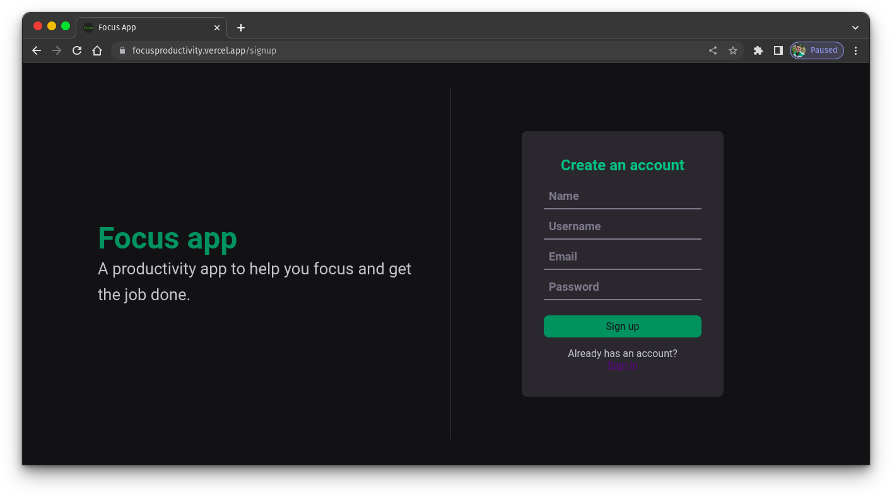

<h1 align="center">Focus</h1>

An application to increase productivity and practice some fundamentals of ReactJS

 <a href="#pre-requisitos">Prerequisites</a> •
 <a href="#objetivo">Goals</a> •
 <a href="#tecnologias">technologies</a> • 
 <a href="#autor">Author</a>

<h4 align="center"> 
    Focus App 🚀 completed!
</h4>

<h3 id="pre-requisitos">Prerequisites</h3>

Before starting, you will need to have the following tools installed on your machine:
[Git](https://git-scm.com).
Besides, it's good to have an editor to work with the code like [VSCode](https://code.visualstudio.com/)

- Clone the repository:

<code>git clone https://github.com/TiagoAraujoDev/BeProductiveApp.git</code>

- Change to the repository folder, install the dependencies and run the script to run the application locally:

<code>cd FocusApp/</code>

<code>npm install</code>

<code>npm run dev</code>

<h3 id="objetivo">🎯 Goals</h3>

- In this project I was practing ReactJS building a modern and usefull application.
- To follow the market needs I was using Typescript in this app and others before this one, because the typing is a good feature to development.
- The most import technologies used in this app was vite to create a good development enviroment and some important libraries such as react-hook-form to manage forms, zod to help with typing, immer to work with immutability in a easy way, styled-components to give styles to the app and react-router-dom to create routes.
- A clean code was my main goal here. No design patterns just a readable code.
 
<h3 id="tecnologias">🛠 technologies</h3>

The following tools were used in building the project:

- [Typescript](https://www.javascript.com/)
- [ReactJS](https://www.reactjs.org/)
- [Vite](https://vitejs.dev/)

<h3 id="autor">Author</h3>

<a href="https://www.linkedin.com/in/tiago-muniz-de-araujo-2b5b8a89/">
 
  
 <b>Tiago Araujo</b></a> <a href="https://app.rocketseat.com.br/me/tiago-muniz-de-araujo-01020" title="Rocketseat">🚀</a>

Made by Tiago Araujo 👋🏽 contact!

 

