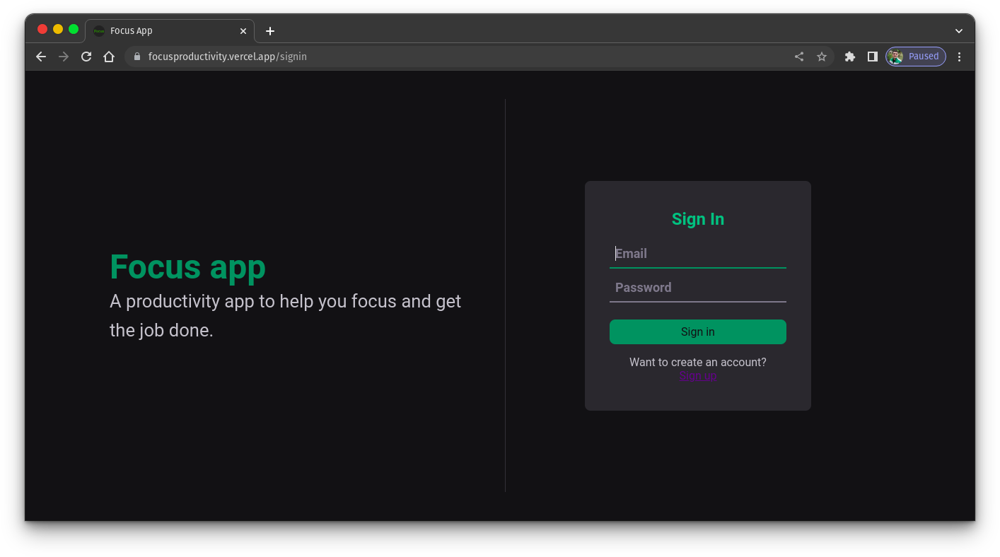
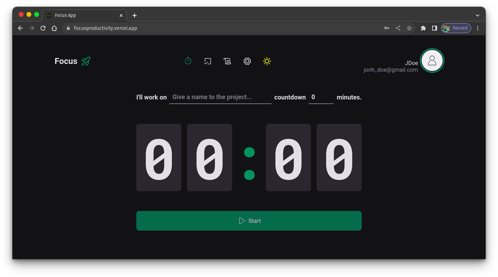
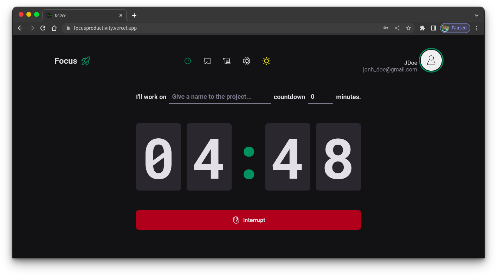

<h1 align="center">Focus</h1>

An application to increase productivity and get the job done

 <a href="#pre-requisitos">Prerequisites</a> •
 <a href="#objetivo">Goals</a> •
 <a href="#tecnologias">technologies</a> • 
 <a href="#autor">Author</a>

<h4 align="center"> 
    Focus App 🚀 completed!
</h4>

<h3 id="pre-requisitos">Prerequisites</h3>

Before starting, you will need to have the following tools installed on your machine:
[Git](https://git-scm.com) and [Node](https://nodejs.org/en/).
Besides, it's good to have an editor to work with the code like [VSCode](https://code.visualstudio.com/)

if you want to run the app in your machine, follow the steps above:

- Clone the repository:

<code>git clone https://github.com/TiagoAraujoDev/FocusApp.git</code>

- Change to the repository folder, install the dependencies and run the script to run the application locally:

<code>cd FocusApp/</code>

<code>npm install</code>

<code>npm run dev</code>

- This application is connected with Focus_API. Go to https://github.com/TiagoAraujoDev/API_Focus and follow the instructions there to run the API locally or make the adjustments to work with your own API.

<h3 id="objetivo">🎯 Goals</h3>

- In this project I wanted to create a productivity app that help me to organize my to-dos and get focus.
- To build this application I used Reactjs to create a SPA(single page application) and all the authentication and data persistence It's been manage by Focus_API.
- All the authentication is made using JWT and with refresh-token strategy. When the user loggin the api sends a response with an access token and a refresh-token, but the refresh-token is sent in a httpOnly cookie. The access token is saved on the application memory and I made a custom hook that makes a request to the refresh-token endpoint to refresh the access token when the user closes and refresh the page. So that way the don't need to save the access token in localstorage or in database. When the refresh-token expires the application send the user to the loggin and the cycle restart.
- I made use of axios interceptors to add the token to the request and refresh the token if the token is expire and get a 403.
- The most important technologies used in this app were vite to create a good development environment and some important libraries such as react-hook-form to manage forms, zod to help with form validation and typing integration, the contextAPI to share to information and keep all the components more readable for refactor, changes and improvements, styled-components gives to the app styles and keep it scoped and react-router-dom to create routes and the strategy to persist the user session and verify if there's a session.
- A clean code was my main goal here. No design patterns just a readable code.
 
<h3 id="tecnologias">🛠 technologies</h3>

The following tools were used in building the project:

- [Typescript](https://www.javascript.com/)
- [ReactJS](https://www.reactjs.org/)
- [Vite](https://vitejs.dev/)
- [Focus_API](https://github.com/TiagoAraujoDev/API_Focus)

<h3 id="autor">Author</h3>

<a href="https://www.linkedin.com/in/tiago-muniz-de-araujo-2b5b8a89/">
 
  
 <b>Tiago Araujo</b></a> <a href="https://app.rocketseat.com.br/me/tiago-muniz-de-araujo-01020" title="Rocketseat">🚀</a>

Made by Tiago Araujo 👋🏽 contact!

 

